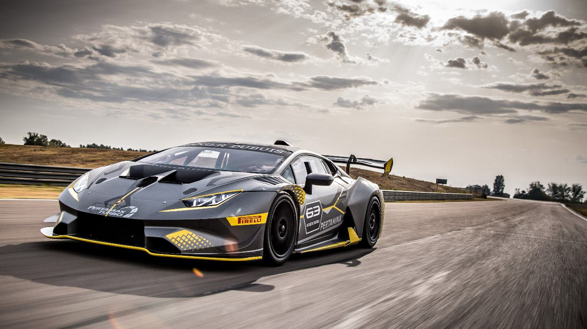

# 🖼️ Basic Image Processing using Python & PIL

This repository demonstrates essential image transformations using the PIL (Pillow) library in Python.

## 📚 Features Covered
- ✅ Load image using PIL
- 🔄 Resize image
- 🔁 Rotate image
- 🌑 Convert to Grayscale
- 💾 Save processed images

These operations are widely used in image preprocessing for machine learning and computer vision.

## 🧰 Requirements
- Python 3.x
- Pillow
- Jupyter Notebook

## 🚀 Getting Started

```bash
git clone https://github.com/yourusername/image-processing-with-pil.git
cd image-processing-with-pil
pip install pillow
jupyter notebook Image_Processing_with_PIL.ipynb
```

## 📸 Example Output

| Original | Grayscale | Rotated |
|----------|-----------|---------|
|  |  |  |

---

## 📬 Connect
- LinkedIn: [Your Name](https://linkedin.com/in/yourprofile)
- GitHub: [@yourusername](https://github.com/yourusername)

---

⭐ **Star** this repo if you find it helpful!
